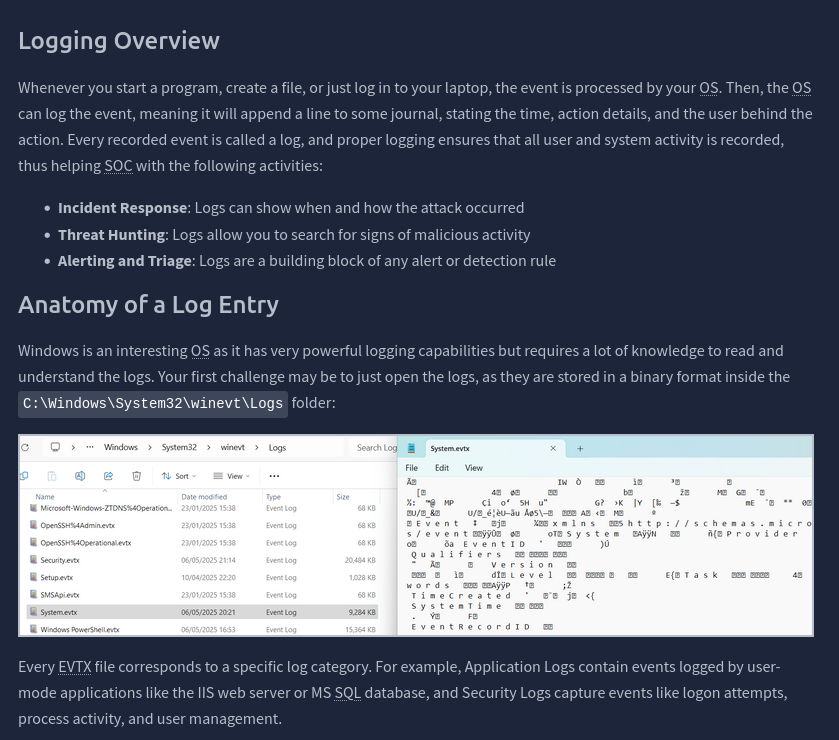
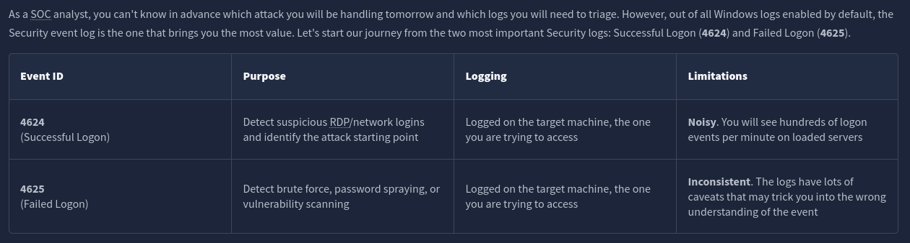
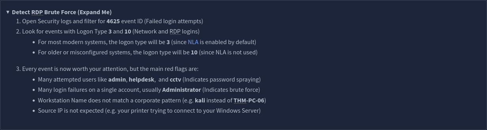
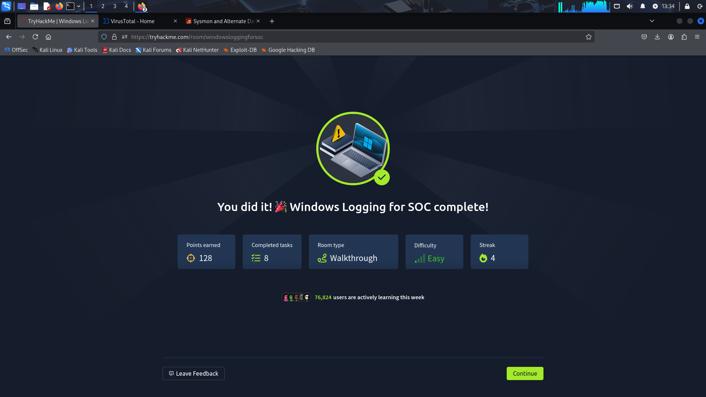

# My Journey into Windows Log Analysis: A TryHackMe Walkthrough 🕵️‍♂️

## Hello! 👋 Welcome to my documentation for the "Windows Logging SOC" room!

This wasn't just another room for me; it was a deep dive into the defender's side of cybersecurity. After spending some time exploring offensive techniques, I wanted to understand how defenders catch attackers. This room was the perfect introduction to the crucial skill of a SOC (Security Operations Center) analyst: reading the digital breadcrumbs attackers leave behind.

I’ve documented my key learnings, takeaways, and some of the "aha!" moments I had along the way.

**Room:** [Windows Logging SOC](https://tryhackme.com/room/windowsloggingforsoc)
**Difficulty:** Easy (but incredibly valuable!)
**Topics Covered:** Windows Event Logs, Event Viewer, Sysmon, PowerShell Logging, and Threat Hunting.

## My Learning Journey: What I Discovered

### 1. The Log Never Lies: My First Look at a Windows Log 🔍

I quickly learned that on a Windows machine, nothing happens without a trace. Every user login, every file change, and every network event is meticulously logged. I was introduced to the `C:\Windows\System32\winevt\Logs` directory, which is the treasure chest for all this information. The logs are stored in `.evtx` format, which means I needed a special tool to read them.

This led me to the **Windows Event Viewer**. It’s like a built-in search engine for all the activity on a machine!

*This is the file path where all the magic happens, and a first look at the Event Viewer, which became my best friend in this room.*

### 2. Event IDs are the Language of Logs 💬

This was a key part of the room. It’s impossible to read every single log entry, so the trick is to know what to look for. I focused on some crucial Event IDs that a SOC analyst would use to spot trouble:

* **`4624` (Successful Logon):** This isn't always malicious, but a successful login from an unusual place can be a big red flag!
* **`4625` (Failed Logon):** My best friend for finding brute-force attacks. A ton of these from the same IP address or for the same username is a definite sign of an attack.
* **`4720` (User Account Created):** A must-watch event! An attacker will often create a new account to maintain a foothold, and this log is a perfect way to spot that.

*A look at some of the key Event IDs and why they matter to a defender.*

### 3. Going Beyond the Basics: Sysmon and PowerShell Logging 💡

This was where the room really got interesting for me. I learned that standard Windows logs don't always give the full story.

* **Sysmon:** This tool felt like an upgrade to my logging capabilities. It provides a more detailed, descriptive view of system activity, like monitoring process creation and file changes. It gives the defender a much clearer picture of what’s happening on a system.
* **PowerShell Logging:** Attackers often use PowerShell because it can be used stealthily. But the biggest "gotcha" for them? It creates a special, **immutable log** of every command executed. This means even if they try to be quiet, a defender can find a perfect record of their actions.

This was a major "aha!" moment for me. It shows that even when attackers think they've covered their tracks, a skilled analyst can find the evidence.

### 4. Putting it All Together: Hunting for RDP Brute Force Attacks 🎯

The final task was putting my new skills to the test. I used the Event Viewer to filter for `4625` events and successfully identified a brute-force attack against an RDP service. It was so cool to see all the theory come together in a practical scenario!

*This screenshot shows a hint for a task I was working on, proving that I was focused on the right things!*

## And That's a Wrap!

This was an incredibly valuable room that gave me a new appreciation for the blue team side of cybersecurity. It solidified my belief that knowing how systems work—not just how to break them—is the key to a strong security foundation.

*The final proof! Another challenge completed.*

## Disclaimer

This repository is a personal learning journal. All content and documentation are for educational purposes and based on my experience with the TryHackMe platform.
